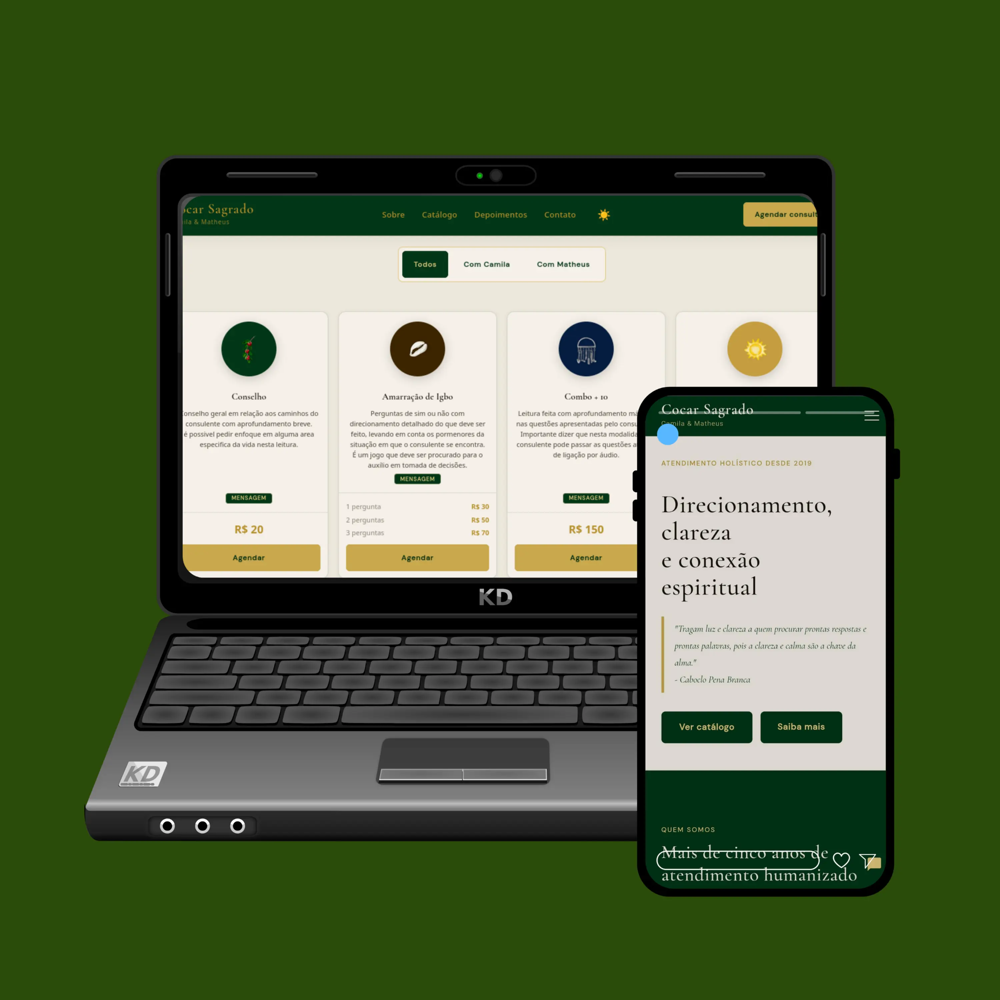

# Cocar Sagrado



O Cocar Sagrado atua no nicho de terapêutica oracular desde 2019. Com uma base sólida de clientes construída ao longo dos anos, o processo de agendamento e pagamento era feito 100% pelo WhatsApp — o que funcionava, mas não escalava.

Desenvolvi uma solução completa pra resolver isso: um site com catálogo de serviços, fluxo de agendamento online e pagamento integrado, tirando essa dependência do WhatsApp e organizando a operação toda num lugar só.

---

## O que o site faz

- Catálogo com todos os serviços e valores
- Agendamento online com escolha de consultor, data e horário
- Pagamento via InfinityPay com confirmação automática
- Desconto de 10% pra novos clientes
- Chat com IA pra tirar dúvidas sobre os serviços
- Tema claro/escuro automático pelo horário do dia

## Painel administrativo

Separado do site principal, o painel dá controle total sobre:

- Horários disponíveis por consultor
- Descontos ativos
- Agenda de agendamentos
- Exportação de CSV com histórico de leituras e valores arrecadados (pra prestação de contas)

## Tecnologias

- HTML, CSS e JS puro no front
- Supabase pro banco e Edge Functions
- InfinityPay pra pagamentos
- Groq API no chat de atendimento
- Deploy no Cloudflare Pages

## Estrutura

```
cocarsagrado/
├── index.html
├── css/
├── js/
├── admin/
│   └── dashboard.html
├── images/
└── supabase/
    ├── functions/
    │   ├── ai-chat/
    │   ├── infinitypay-checkout/
    │   └── infinitypay-webhook/
    └── sql/
```

## Rodando local

Sem build. Abre o `index.html` direto ou sobe qualquer servidor estático.

Pra testar as functions:

```bash
supabase functions serve
```

Os SQLs em `supabase/sql/` precisam estar sempre sincronizados com o banco real.

---

Feito com o cuidado que o projeto merecia — [Matheus](https://github.com/MatheusGustav) [](https://instagram.com/gustavdev.js)

**Cocar Sagrado** — [cocarsagrado.com.br](https://cocarsagrado.com.br)
[@cocarsagrado](https://instagram.com/cocarsagrado) no Instagram, TikTok, Threads, Bluesky e X
